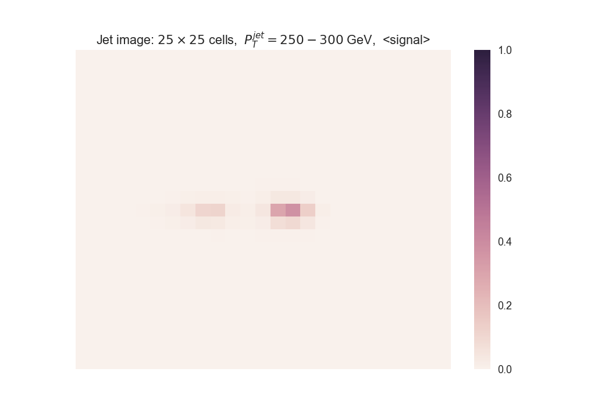
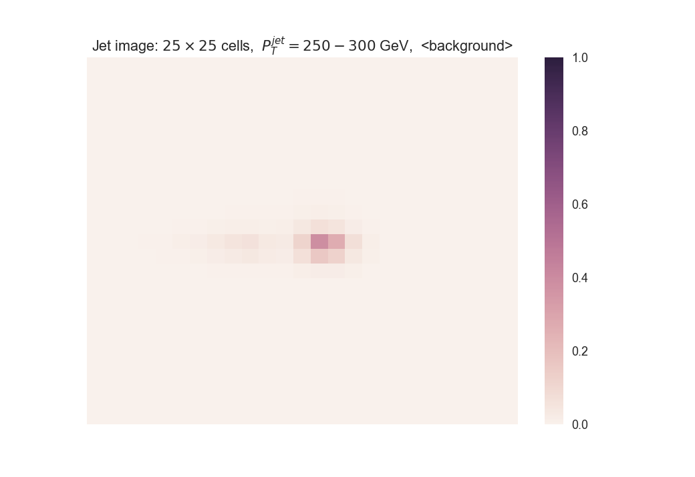
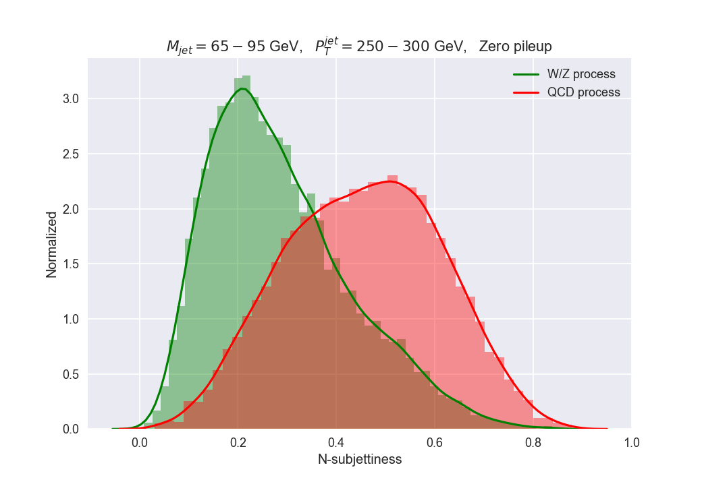
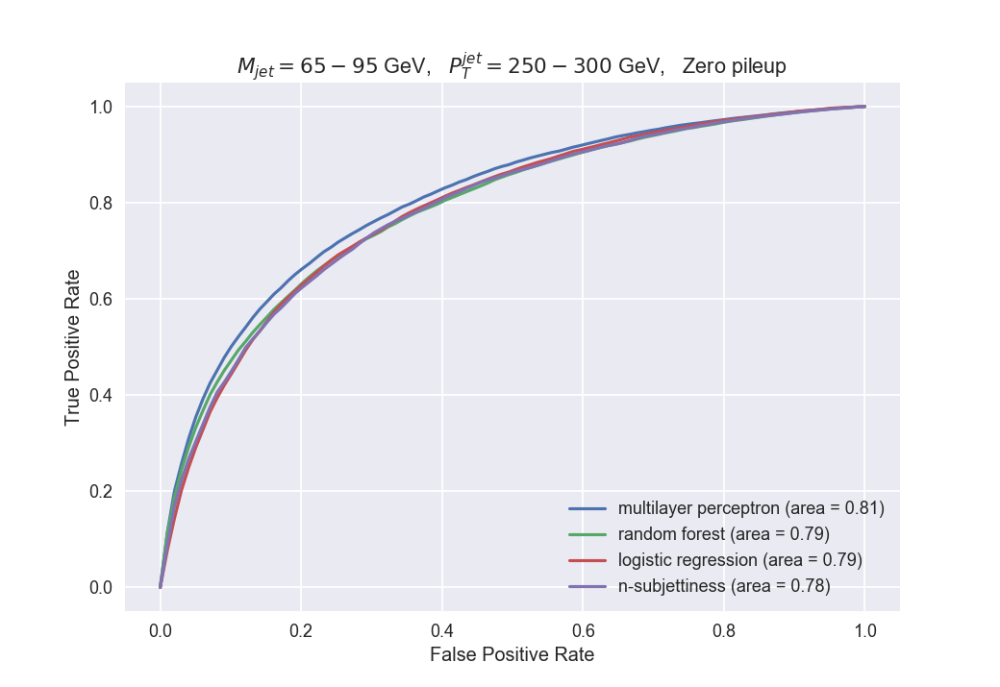

# Jet classification 
Modules for the jet classification work. 

## Instructions
  * Create a virtual environment in the development machine **ml-dev.ncc.unesp.br**
```shell
conda create -p .env/mlwork -c intel python=3.6
source activate .env/mlwork
```
  * Install requirements
```shell
conda install numpy scipy matplotlib seaborn pandas scikit-learn
```
  * Clone github repository
```shell
git clone https://github.com/jruizvar/jet-classify.git
```

## Running examples

  * Plot average jet image for signal and background
```shell
python modules/plot_image.py data 250-300 
```



  * Plot n-subjettiness
```shell
python modules/plot_tau21.py data 250-300 
```


  * Principal components analysis
```shell
python modules/pca_analysis.py data 250-300
```


  * ROC curve
```shell
python modules/plot_roc_curve.py data 250-300
```

