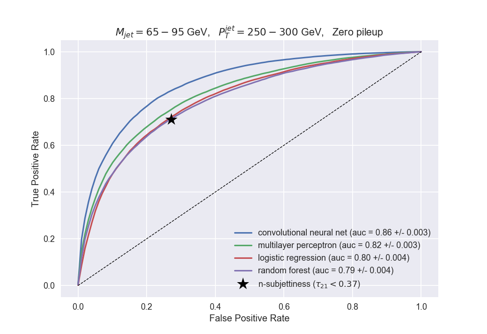

# Jet classification 
Modules for the jet classification work.

# Running examples

  * N-subjettiness plot
```shell
python3 modules/get_data.py data 250-300 
```


  * Principal components analysis
```shell
python3 modules/pca_analysis.py data 250-300
```


  * ROC curve
```shell
python3 modules/plot_roc_curve.py data 250-300
```

